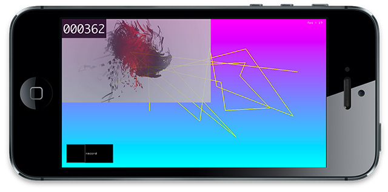

ofxiOSVideoWriter is a openFrameworks addon for screen recording on iOS.

The iosScreenRecordExample demostrates how graphics and video can be recorded into a h264 video in real-time. Sound from the source video is also recored to the output video, although ofxiOSVideoWriter only supports the recording of one audio source at the one time (for now).

AssetsLibrary.framework - needs to be added to xcode project libraries.

This addon was developed during the Foxtel All Stars iOS project, which allows for live video compositing and recording in OpenGL using openFrameworks. For a better understanding of how this addon can be used, feel free to checkout the app. [https://itunes.apple.com/au/app/foxtel-all-stars/id814838234?mt=8](http://)